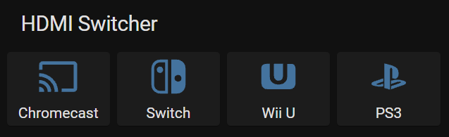

<div align="center">

# Kinivo HS420 Serial Control Server


</div>


This project is a small server I wrote to control my HS420 HDMI Matrix/Switcher via the RS232 port. I run it on a Raspberry Pi connected via a Serial-to-USB cable, controlled by [Home Assistant](https://www.home-assistant.io/)'s [RESTful Command Integration](https://www.home-assistant.io/integrations/rest_command/).

## Installation

This project has one dependency. Run ``go get`` to install it:
```bash
go get github.com/bmizerany/pat
```

To build the binary, run:
```bash
go build hs420srv.go
```

## Usage

Currently supports Linux only. Run the server to start, providing the appropriate serial port as an argument:
```bash
./hs420srv /dev/ttyUSB0
```

The server listens on port 10330.

``GET /version`` Returns the current version. Mostly used to test the API is online.

``POST /power`` Toggle the device on or off

``POST /switch/<TV>/input/<INPUT>`` Switches the displayed input for the specified TV. TV is either 1 or 2. Input is 1-4.

This program was built without any concern for security. If you do decide to use it, make sure to lock it down behind a firewall. I used [ufw](https://help.ubuntu.com/community/UFW) to block anyone other than Home Assistant from calling the API.

## License
[MIT](https://choosealicense.com/licenses/mit/)